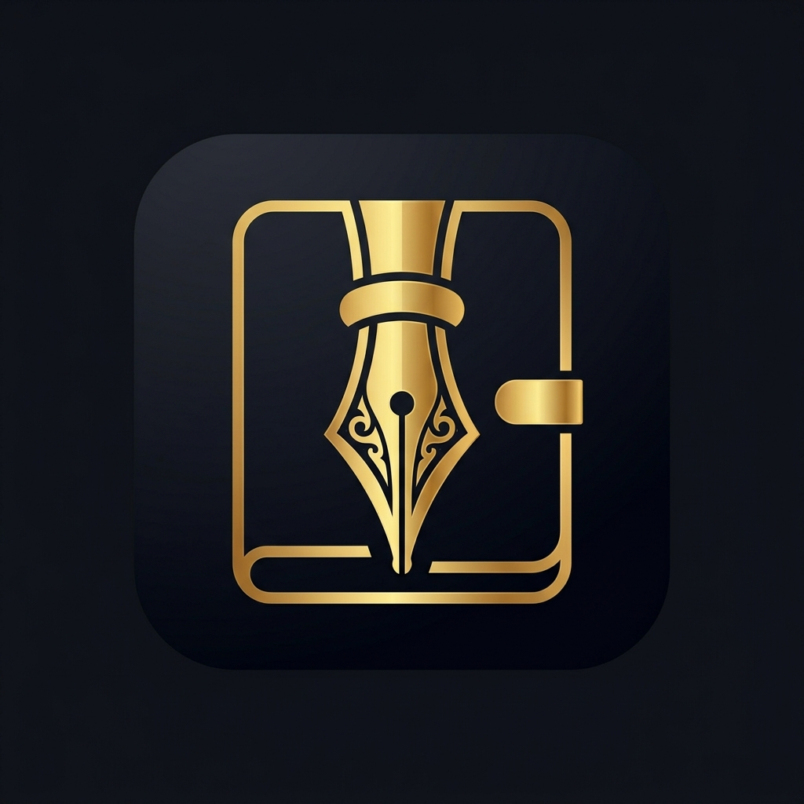

#  Devil's Book

[English](README.md) |
[čeština](README-cs.md) |
[Deutsch](README-de.md) |
[Türkçe](README-tr.md) |
[中文 (简体中文, 中国)](README-zh-CN.md) |
[中文 (繁體, 台灣)](README-zh-TW.md) |
[العربية](README-ar.md)

**A cross-platform dark notes app — the Devil's own grimoire.**

Devil's Book is a premium, highly atmospheric digital manuscript and writing instrument. It uses technology to elevate the sensation of writing, prioritizing aesthetics and feel over broad utility. This is not a generic notes app — it is a stylus-first, dark, cinematic digital manuscript built for those who treat handwriting as craft.

Write with white ink on black parchment. Let your notes invert seamlessly in dark mode — images, PDFs, and all. The canvas compositing engine renders highlights without overlap artifacts or color bleed, producing results that surpass traditional paper. Organize your manuscripts in endlessly nested folders, with recent work always at your fingertips.

Devil's Book is fully open-source. Every line is auditable; nothing is hidden.

[][releases]
[][releases]

Tap to show/hide screenshots

## Features

- **Dark-mode-first design** — write with light ink on dark parchment, engineered for atmosphere
- **Stylus-optimized** — pressure-sensitive, low-latency handwriting built for real writing instruments
- **Smart highlighting** — canvas compositing eliminates overlap artifacts and color bleed
- **Adaptive inversion** — images and PDFs invert automatically in dark mode
- **Infinite nesting** — organize manuscripts in deeply nested folders with no limits
- **Cross-platform** — runs on Android, iOS, Windows, macOS, Linux, and the web
- **Open-source** — every line of code is auditable

## Build from source

Devil's Book is a Flutter application. To build from source:

1. Install [Flutter](https://docs.flutter.dev/get-started/install)
2. Clone this repository
3. Run `flutter pub get` to fetch dependencies
4. Run `flutter run` to launch in debug mode, or `flutter build` to produce a release build

For more details, see the
[Maintainer notes][wiki] on the wiki.

## Links

- [Privacy policy][privacy]
- [License][license]
- [Releases][releases]

## Contributing

Contributions are welcome! Please open an issue or pull request on [GitHub][issues].

When contributing, follow the conventions described in [AGENTS.md](AGENTS.md).

## Development notes

Please see
[Maintainer notes][wiki]
on the wiki.

## Acknowledgements

Devil's Book is a community fork of [Saber](https://github.com/saber-notes/saber),
originally created by [Adil Hanney](https://github.com/adil192).
We gratefully acknowledge the upstream project and its contributors.

[privacy]: privacy_policy.md
[license]: LICENSE.md
[releases]: https://github.com/zedraxa/DevilsBook/releases
[issues]: https://github.com/zedraxa/DevilsBook/issues
[wiki]: https://github.com/zedraxa/DevilsBook/wiki/Maintainer-notes
